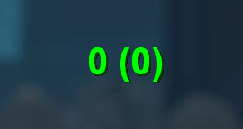

# Velocity - CS:GO Speed Overlay

Отображение скорости игрока в CS:GO в реальном времени.



## Функции

- Overlay поверх игры с текущей скоростью
- Формат: `скорость (последняя)` — например `247 (240)`
- Pattern scanning — не нужно обновлять оффсеты вручную
- Две версии: External (EXE) и Internal (DLL)

## Версии

### External (рекомендуется)
Отдельная программа, читает память игры извне.

**Плюсы:**
- Не требует инжектор
- Безопаснее
- Легко обновлять

**Сборка:**
```sh
cd External
msbuild External.sln /p:Configuration=Release /p:Platform=x86
```

**Использование:**
1. Запусти CS:GO
2. Запусти `External.exe` от администратора
3. Готово!

### Internal
DLL для инжекта в процесс игры.

**Плюсы:**
- Работает изнутри процесса

**Сборка:**
```sh
cd Internal
msbuild Internal.sln /p:Configuration=Release /p:Platform=x86
```

**Использование:**
1. Запусти CS:GO
2. Инжектни `Internal.dll` любым инжектором (Standard/LoadLibrary)
3. Готово!

## Управление

| Клавиша | Действие |
|---------|----------|
| HOME | Скрыть/показать консоль |
| DELETE | Скрыть/показать overlay |
| END | Выход (только External) |

## Структура проекта

```
├── External/          # External версия (EXE)
│   ├── src/
│   │   └── main.cpp
│   ├── External.sln
│   └── External.vcxproj
├── Internal/          # Internal версия (DLL)
│   ├── src/
│   │   └── main.cpp
│   ├── Internal.sln
│   └── Internal.vcxproj
├── Offsets/           # Оффсеты hazedumper (для справки)
└── images/            # Скриншоты
```

## Требования

- Visual Studio 2022
- Windows SDK 10.0
- CS:GO (не CS2!)

## Лицензия

MIT License
